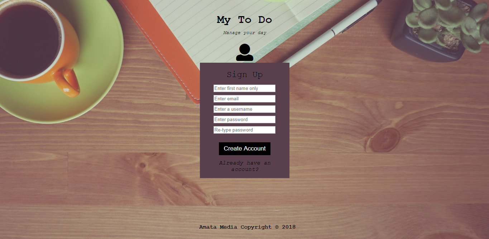

# To-do list web application

This web application is a clone of the Google chrome productivity extension, [Momentum](momentumdash.com). The to-do web app aids the user in managing their activities for the day in a list format. A new user signs up with their details stored on a MySQL database. On successful signing up, the user is redirected to their homepage that displays a personalized greeting; this varies at different times of the day. Returning users only need to sign in to access their homepage.

Activities to be added on the list are typed into the input field below the '*What are we doing today?*' text and submitted. Each item on the list is appended with a checkbox on the left of the text of the activity and a delete button on the right.

Completed items are checked off to take the off the list. A confirmation box pops up when the user clicks on the delete button to remove an item on their to-do list. In addition, the activities on the list can be edited by simply clicking on the relevant text to be revised.

Session storage is used in storing the items on the list. A custom coded function is used to populate the to-do list using the key and values from the session storage. This is to ensure that the to-do list persist on the page even on a page reload. When the user signs out, the session storage is cleared.

___

## Technologies used

The front-end of this web application was programmed with **HTML5**, **CSS3**, **JavaScript** and **PHP**. **PHP** and **MySQL** were used on the backend.

No frameworks were used in developing this application.
___

## Further Improvements

Currently, the list items get deleted once the web page is refreshed. Additionally, the '*forgot password?*' feature is inactive. I am working on activating this feature by using user authentication on the PHP framework, **Laravel**. Laravel will enable me to handle user details more securely.

___
## Screen shots

### Sign up page

### Sign in page

### Home page

### Home page at night

___

**Disclaimer:** This to-do web app is/was programmed for the purpose of learning web development only.
